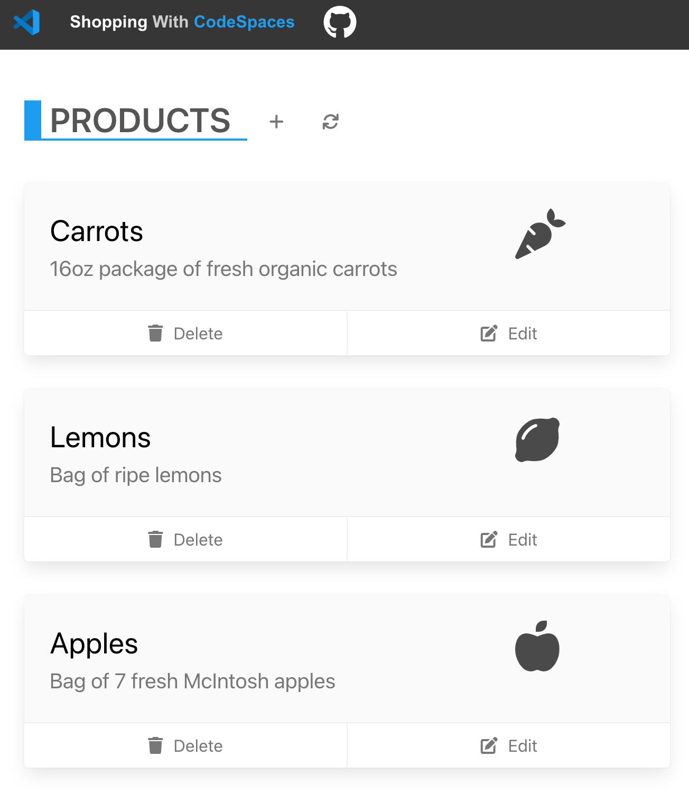

# Shopping with Codespaces

This is a quick node project template for demoing Codespaces. It is based off of the [Azure node sample](https://github.com/Azure-Samples/nodejs-docs-hello-world) and [Haikus for CodeSpaces](https://github.com/2percentsilk/haikus-for-codespaces) by [Allison Weins](https://github.com/2percentsilk).

## Setup

1. Create a new repository in your organization using the `Use this template` button
1. Name your repository and continue

## Demo Scenario

An urgent request from your project stakeholders has been sent to you to fix an app. You're asked to jump into the project and add a new missing product and sort the list of products alphabetically. You need to make those changes and you don't have the development environment necessary. But not to worry, you know you can use **github.dev** in the browser to make these changes.



### Adding the product in github.dev

1. You browse to the repository on GitHub at <https://github.com/johnpapa/shopping-for-codespaces>.
1. You press `.` and the code instantly opens in **github.dev**, a fast and free lightweight VS Code editor in the browser.

    

   > You've customized your local VS Code exactly how you like it. The good news is you can bring those customizations to the browser too!

1. Press the `Accounts` icon in the bottom left of the window (the icon that looks like a user profile).
1. Select `Turn on Settings Sync`

   > This will bring all of your settings saved to your profile!

   

1. Select `Sign in and turn on`
1. Since this is your first time, you will `replace local`.

   > Notice that your editor is using your settings from your profile! This can be enabled by turning on or off Setting Sync. All of your settings, extensions, and keyboard preferences are available.

    

1. You press `<F1>` to open the command palette.
1. You type and select `Create New Branch` and name it `fix/products`
1. You press `<ENTER>` and select `Switch to Branch` and `Leave Site` to refresh to the new branch.
1. You open the file containing the products in `products.json`.
1. You add the missing product for hot peppers and save the file.

   ```json
   {
     "id": 40,
     "name": "Hot Peppers",
     "description": "8 oz package of hot peppers",
     "quantity": 1,
     "imageClass": "fas fa-pepper-hot fa-3x"
   }
   ```

1. You commit the file changes.
1. You push the changes and publish the branch.

### Transition to CodeSpaces to run and debug

1. You want to see the application run to make sure the hot peppers are displayed, so you press `<F5>` to open the debugger.

   > You need compute power to run the app and debug it. You can seamlessly transition from **github.dev** to the full power of compute in the cloud. Let's see how.

1. Press the button `Continue Working On ...` and then select `Create New CodeSpace` to be transitioned to CodeSpaces.

   > The browser refreshes and you're now working with compute resources which allow you to run, debug, and use the terminal. It even ran `npm install` to prepare your app by installing your dependencies! This is using the default devcontainer for Node.js. You can create a custom devcontainer, by following the link in the terminal comments. But that's for another day, let's debug your app.

    

1. Set a breakpoint in the `index.js` file on the line that renders the products.

1. You press `<F5>` to debug the app.

   > CodeSpaces recognizes this as a JavaScript application and prompts you for the debugger profile.

1. You select `Node.js` as the profile and the debugger launches the application.
1. CodeSpaces alerts and prompts you to open the browser to see the running web application, so you press the button `Open in Browser`, which launches the app.

   > You hit the breakpoint you set in CodeSpaces. You can now debug your application and inspect and change variables.

    

1. You remove the breakpoint and let the debugger continue to render the web apge.

   > You notice your hot peppers have been added! Now you want to show the changes to your stakeholders before your merge to the `main` branch, so they can test it and confirm it works for them. You can do this by making your forwarded ports public.

### Forward your ports publicly to your stakeholders to view them

1. Select the `Ports` tab in the Terminal pane.
1. Notice the visibility is set to `private` by default. You will right click and select `Port Visibility` and `Public`

   > Setting the port to public allows your stakeholders to see the app.

    

1. Now the URL can be shared with your stakeholders.

   > Your stakeholders review the running app and their pleased ... until they notice that the products are not sorted in the proper ascending order by name. Uh oh! You're going to have to fix that! But you can't remember the exact syntax to sort the JavaScript array. You'll use GitHub Co-Pilot to do this.

### Sort the products using the help of Copilot

1. Stop the debugger.
1. You press `<F1>` to open CodeSpaces' command palette.
1. You select `View: Show Extensions`
1. You search for `GitHub Copilot`, press `Install`, and agree to the terms
1. You open the file `index.js` and put the cursor directly before the `render` code.
1. You type `///` to engage with Copilot
1. You type `/// sort the products by name in ascending order`, and hit `<TAB>` and `<ENTER>` to accept each line.
1. You are prompted line by line for the code to sort the products. It looks appropriate, so you click `<ENTER>` on each line to accept it, until it is complete.
1. You delete the old line of code to render the products, now that you have replaced it.
1. You press `<F5>` to debug and select `Node.js` as the profile and the debugger launches the application.
1. You open the browser and see your changes worked!

   > Copilot just helped you write the code to sort the products directly in CodeSpaces in the browser. Now let's save your changes.

    

   ```javascript
   app.get('/', (req, res) => {
     /// sort by name in ascending order
     let sortedProducts = products.sort((a, b) => {
       if (a.name < b.name) {
         return -1;
       }
       if (a.name > b.name) {
         return 1;
       }
       return 0;
     });
     res.render('index', { products: sortedProducts });

     // res.render('index', { products });
   });
   ```

    

### Merge your changes

1. You stop the debugger.
1. You commit your changes and push them to the branch.
1. You create a new Pull Request.
1. You review, approve and merge the pull request to the `main` branch.
