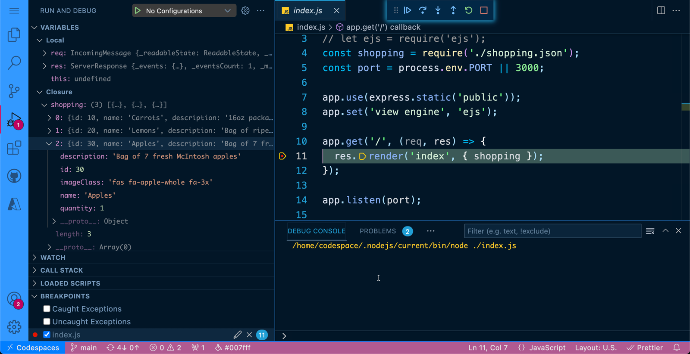

# Shopping with Codespaces

This is a quick node project template for demoing Codespaces. It is based off of the [Azure node sample](https://github.com/Azure-Samples/nodejs-docs-hello-world) and [Haikus for CodeSpaces](https://github.com/2percentsilk/haikus-for-codespaces) by [Allison Weins](https://github.com/2percentsilk).

## Quick Start

### Edit on GitHub

1. Create a new repository in your organization using the `Use this template` button
1. On your repo, press `.`
1. Edit and save your desired files
1. Commit the files
1. Push the commit

### Edit and run with CodeSpaces

1. Follow the previous steps to [Edit-on-GitHub](#Edit-on-GitHub)
1. Click on the bottom left corner where it says `GitHub`
1. Select `Continue working on ...`
1. Select `Create new CodeSpace`
1. In the terminal, type `npm install` and press `<ENTER>`
1. Press `<F5>`
1. Select `Node.js`
1. Open a browser to <http://localhost:3000>

## CodeSpaces

## Sample App

